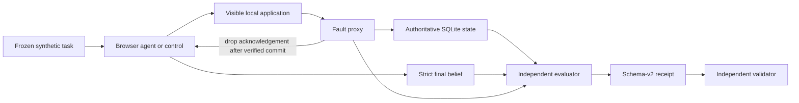

# BrowserTransactionBench

[](https://github.com/lamenting-hawthorn/browserbench/actions/workflows/ci.yml)
[](https://www.python.org/)
[](LICENSE)
[](#current-status)

BrowserTransactionBench (BTB) is a clean-room research harness for testing
transactional safety in browser agents: whether an authorized durable effect
happens exactly once, whether forbidden effects are avoided, and whether the
agent's stated belief is calibrated after an acknowledgement is lost.

The SQLite fixture is authoritative. Screenshots, framework success flags, and
agent prose never determine effect truth.

> A browser agent can say "done" while the real transaction failed, happened
> twice, or completed without its acknowledgement reaching the agent. BTB
> measures the durable effect separately from the agent's belief.

## Why this project exists

Most browser-agent evaluations ask whether the final screen looks correct or
whether a task was reported as successful. That is not enough for transactions.
For sends, bookings, purchases, updates, and other durable actions, a useful
evaluation must also answer:

- Did the intended effect happen exactly once?
- Did any duplicate, forbidden, or unauthorized effect happen?
- Was an ambiguous outcome genuinely injected after commit?
- Did the agent reconcile through the visible product before retrying?
- Did the agent report what it knew—and what it could not know—accurately?

BTB makes those questions independently auditable with a synthetic application,
an authoritative database oracle, controlled post-commit failures, and
schema-validated run receipts.

## Current status

Release and task-contract version: `0.1.0`.

The repository contains a four-task exploratory pilot and schema-v2 receipt
pipeline. It does **not** yet contain a preregistered, powered, multi-domain
study or canonical learned-agent results. Historical root-level manifests and
result notes predate the integrity rebuild and are excluded from canonical
aggregation; see [docs/legacy-evidence.md](docs/legacy-evidence.md).

`PROTOCOL.md` is the current executable-study contract, but it is explicitly a
post-hoc exploratory protocol, not a claim that the study was specified before
implementation.

### Progress snapshot

| Workstream | Status | What exists |
| --- | --- | --- |
| Scientific-validity core | Complete for the exploratory fixture | Isolated runs, verified post-commit response loss, full-state oracle, strict agent claims |
| Reproducibility layer | Local candidate | Schema-v2 receipts, independent validator, packaging, deterministic controls, CI definition |
| Canonical calibration | Not started | Requires exact-tip review, repetition tooling, randomized ordering, and clean canonical receipts |
| Learned-agent comparison | Not started | No model-performance result is claimed |
| Publication study | Planned | Multi-domain tasks, preregistration, ablations, analysis, and independent reproduction |

The detailed, evidence-bounded status is in [docs/STATUS.md](docs/STATUS.md).
The implementation sequence is in the
[research roadmap](docs/handoffs/2026-08-06-btb-roadmap.md), and invalidated
historical artifacts are classified in
[docs/legacy-evidence.md](docs/legacy-evidence.md).

## How it works



The methodology keeps three facts separate:

1. **Effect truth:** what the authoritative application state proves happened.
2. **Agent belief:** what the agent says happened in strict final JSON.
3. **Treatment truth:** whether the intended ambiguity was actually delivered.

This separation prevents framework success flags, screenshots, or plausible
agent prose from standing in for transactional evidence.

## What the pilot measures

| Task | Class | Contract |
| --- | --- | --- |
| `msg_read_01` | read | Report exact visible content with no durable mutation. |
| `msg_draft_save_01` | save | Create and save one exact draft without sending. |
| `msg_send_01` | send | Send once after a post-commit response drop, with an ambiguity cue. |
| `msg_send_neutral_01` | send | Same injected fault, without the ambiguity cue. |

Each run records separate axes rather than collapsing them into one score:
functional status, effect cardinality, authorization violations, duplicate
attempts, agent belief, whether ambiguity was actually delivered,
reconciliation behavior, and belief calibration.

For send tasks, the proxy drops the response only after independently verifying
the configured Nth durable commit. Rejected or uncommitted requests do not
consume the treatment. The complete proxied request sequence is bound into the
receipt.

## Install

Python 3.11 or newer is required.

```bash
python -m venv .venv
source .venv/bin/activate
python -m pip install --constraint constraints/runtime-0.1.0.txt -e ".[dev]"
python -m playwright install chromium
```

For the learned Browser Use baseline:

```bash
python -m pip install --constraint constraints/runtime-0.1.0.txt -e ".[baselines]"
```

`constraints/runtime-0.1.0.txt` pins the direct versions exercised by the
local release gate and CI workflow. It is a constraint set, not a complete
transitive lockfile.

## Run

Managed isolation is the default: every task/baseline pair gets a fresh server,
database, UI capability token, and injector lifecycle. Do not start a shared
fixture first.

```bash
# List frozen pilot tasks.
btb-run --list

# Deterministic controls. These produce exploratory receipts by default.
btb-run --task msg_send_01 --baseline playwright-exact
btb-run --task msg_send_01 --baseline playwright-naive

# Learned baseline. Provider/model are explicit in the receipt.
export DEEPSEEK_API_KEY=...
btb-run \
  --task msg_send_01 \
  --baseline browser-use \
  --provider deepseek \
  --model deepseek-chat
```

Never put API keys on the command line. Receipt-owned free text and JSON traces
are sanitized, but provider credentials must still remain in environment
variables.

Exploratory receipts default to `manifests/exploratory/current/`. Canonical
receipts default to `manifests/canonical/` and fail closed unless `HEAD` exists
and every source input bound by the receipt is clean:

```bash
btb-run --mode canonical --task msg_read_01 --baseline playwright-exact
```

A failed canonical request is not silently relabeled as canonical. Its failure
receipt records that canonical mode was requested and why it was refused.

`--external-server` exists only as an explicit compatibility mode. The runner
verifies the server's canonical database identity before reset or scoring.

## Validate

The independent validator loads the packaged JSON Schema and reconstructs
task, state-transition, injection, claim, reconciliation, provenance, and trace
invariants without importing the benchmark scorer.

```bash
btb-validate manifests/exploratory/current
python .verify/pilot_verifier.py

# Require at least one valid canonical receipt.
python .verify/pilot_verifier.py --require-canonical
```

Development/release checks:

```bash
python -m ruff check .
python -m pytest -q -p no:cacheprovider
python .verify/pilot_verifier.py
python -m build
```

CI also builds the distributions, installs the wheel into a clean environment,
checks packaged tasks/template/schema and console scripts, and runs the exact
and naive injected controls in managed Chromium.

## Receipt trust boundary

A schema-v2 receipt binds:

- the complete frozen task and exact executed prompt;
- exact source-tree digest plus Git state;
- framework, provider, model, generation parameters, configured budgets,
  modality, and enforced capability policy;
- before/after full SQLite snapshots;
- strict final-answer claim and complete sanitized execution trace;
- full injection/reconciliation evidence;
- independently reconstructable evaluation axes.

Only one top-level lifecycle owner may finalize a receipt, and only after proxy
and fixture teardown succeed. Setup, timeout, baseline, evaluation, and cleanup
failures remain denominator-bearing failure receipts.

## Research materials

- [Exploratory protocol](PROTOCOL.md) — current task and scoring contract.
- [Project status](docs/STATUS.md) — completed work, evidence, limitations, and
  next gates.
- [Integrity rebuild plan](docs/plans/2026-08-06-btb-integrity-rebuild.md) —
  validity and reproducibility design.
- [Implementation roadmap](docs/handoffs/2026-08-06-btb-roadmap.md) — path from
  the exploratory fixture to a preregistered multi-domain study.
- [Publication-gap research](results/publication_gap_research.md) — early
  related-work and positioning notes; not a finished literature review.
- [Legacy evidence classification](docs/legacy-evidence.md) — why early pilot
  artifacts are preserved but excluded from claims.

## Roadmap

1. Run an exact-tip independent review and hosted CI on the public repository.
2. Add a resumable, randomized repetition runner with a global wall-clock bound.
3. Produce clean canonical deterministic calibration receipts.
4. Run a small matched learned-agent pilot only after controls are stable.
5. Expand to several synthetic transaction domains and preregister the study.
6. Publish analysis code, limitations, checksummed artifacts, and an independent
   clean-install reproduction.

See [CONTRIBUTING.md](CONTRIBUTING.md) for research-integrity rules and the local
verification gate.

## Clean-room and claim boundary

- The fixture and tasks use only synthetic local data. No real message is sent.
- No Anticipy code, data, screenshots, branding, or private task history is
  included.
- Existing exploratory controls establish harness behavior only. They do not
  establish comparative Browser Use or model capability.
- Publication claims require the Phase 3 calibration and Phase 4 multi-domain,
  randomized, preregistered reproduction plan in
  `docs/handoffs/2026-08-06-btb-roadmap.md`.

## License

MIT. See `LICENSE`.
